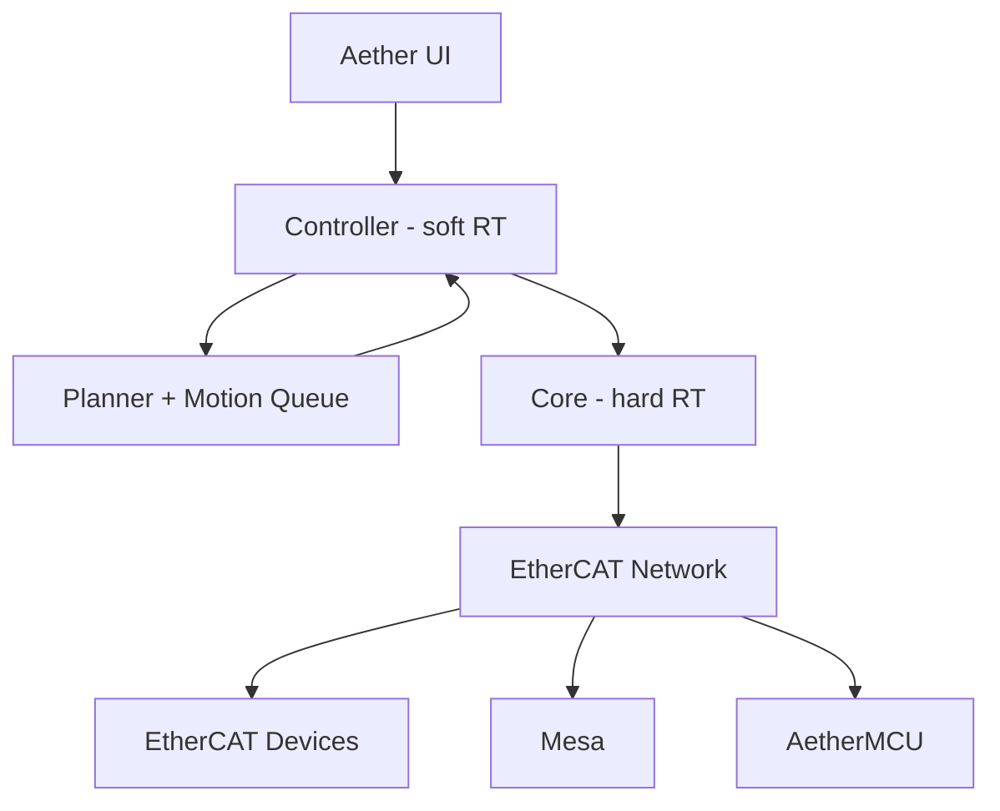

import { Callout } from "fumadocs-ui/components/callout";
import { Cards, Card } from "fumadocs-ui/components/card";
import { Steps, Step } from "fumadocs-ui/components/steps";
import {
  Cpu,
  Gauge,
  Layers,
  Lightbulb,
  Network,
  PackageOpen,
  Radar,
  Rocket,
  Timer,
  Boxes,
} from "lucide-react";

<Callout type="warning">
  ## This documentation is in its very early stages. [!toc] [#alpha-warning]
  We are still working on the alpha release of Aether. 
  Expect things to change and break frequently as we continue to develop the project.
</Callout>

## Overview [#overview]

Aether is the Rust-native framework for high-performance motion control. It blends composable crates with a host runtime that synchronizes real-time workloads across heterogeneous devices. The same building blocks power domain solutions like Aether Printer while remaining reusable in other robotics and motion control contexts.

  
  <Steps>
    <Step>
      

        <Layers className="h-8 w-8 flex-none" color="var(--doc-color-lib)" />
        

          <h3 className="text-base font-semibold text-fd-card-foreground">Composable building blocks</h3>
          

            Compose libraries into turnkey applications or adopt them piecemeal inside existing controllers—no heavy framework baggage required.
          

        

      

    </Step>
    <Step>
      

        <Network className="h-8 w-8 flex-none" color="var(--doc-color-lib)" />
        

          <h3 className="text-base font-semibold text-fd-card-foreground">Unified fieldbus orchestration</h3>
          

            Blend EtherCAT devices, Mesa cards, and custom AetherMCU boards into one coordinated installation without compromising determinism.
          

        

      

    </Step>
    <Step>
      

        <Gauge className="h-8 w-8 flex-none" color="var(--doc-color-lib)" />
        

          <h3 className="text-base font-semibold text-fd-card-foreground">Determinism by design</h3>
          

            Keep tight real-time loops on budget with zero-added overhead so planners, controllers, and the hard real-time core stay perfectly in lockstep.
          

        

      

    </Step>
  </Steps>

## Goals [#goals]

<Cards className="mt-6">
  <Card title="Mission-first motion" icon={<Rocket className="text-red-500" />}>
    

      Make Aether the obvious choice for robot motion control and the modern, Rust-native successor to LinuxCNC—with EtherCAT support baked in from day one.
    

  </Card>
  <Card title="Real-time confidence" icon={<Timer className="text-sky-500" />}>
    

      Meet hard EtherCAT cycle times while higher-level logic stays responsive, thanks to zero-copy, low-overhead interfaces between the controller and the real-time core.
    

  </Card>
  <Card title="Composable Rust surface" icon={<Boxes className="text-amber-400" />}>
    

      Ship modular crates with stable APIs and compile-time enforced versioning so integrators can mix capabilities and evolve systems without breakage.
    

  </Card>
  <Card
    title="Discoverable and observable"
    icon={<Radar style={{ color: "var(--doc-color-lib)" }} />}
  >
    

      Lean on well-defined device descriptors for quick configuration and record the metrics needed to replay motion paths and machine state with precision.
    

  </Card>
</Cards>

## Architecture [#architecture]

### Core and Controller

- Core: hard real‑time. Executes motion schedules and device I/O within strict cycle budgets.
- Controller: soft real‑time. Feeds the core; if it falls behind, the core safely waits for new commands.
- Linking: prefer in‑process linking (controller + core in Rust) to avoid serialization and enable direct data sharing.

### Planner and Motion Queues

- Planner accepts long sequences (e.g., G‑code), enforces machine limits, and produces motion segments.
- Motion queues flow from planner to core; the core marks execution and exposes how much is committed for replanning.
- Control modes (e.g., position follower) sample from movement queues; the planner can update or replace segments.

### Interfaces and Versioning

- Keep controller↔core communication low‑overhead; link for compile‑time API guarantees.
- Introduce explicit serialization only when a stable external interface is required.
- Thin controller patterns allow wrappers (e.g., PyO3 or FFI) without compromising real‑time boundaries.

### Scope and Discoverability

- Keep the real‑time path strictly EtherCAT to limit scope and ensure determinism.
- Integrate non‑real‑time pieces on the controller side.
- Use existing EtherCAT XML descriptors and add higher‑level descriptors when needed; the UI should identify connected hardware and map it to functions.

### High‑Level Diagram [#high-level-diagram]

## Hardware & Protocols [#hardware-protocols]

<Cards>
  <Card title="Device Model" icon={<Lightbulb />}>
      - Treat microcontroller nodes like EtherCAT devices.
      - Use a register‑based protocol for MCUs to align with established fieldbus patterns and support protocol evolution.
  </Card>
  <Card title="Boards and Drivers" icon={<Cpu />}>
    - Focus on a curated set of BSPs (e.g., BTT Kraken, then Octopus) rather than a large hardware matrix.
    - Prefer driver “direct mode” where possible; use very high effective microstepping on the device while keeping host communication compact.
  </Card>
  <Card title="Packaging and Updates" icon={<PackageOpen />}>
    - Aether Printer is distributable as a packaged binary.
    - MCU updates depend on the platform (e.g., DFU on some boards; some EtherCAT devices may not be updated in the field).
    - Minimize firmware churn by decoupling host releases from MCU firmware where feasible.
  </Card>
</Cards>

## What you can build [#what-you-can-build]

Aether is a launchpad for motion‑centric projects — from hobby robots to production‑grade machines. Here are a few ways to put it to work:

- 3D printers with precision and insight
  - Build on Aether Printer to drive multi‑axis printers at high control rates.
  - Run drivers in direct modes with very high effective microstepping while keeping host communication compact.
  - Capture deterministic logs so you can reproduce exact print states, compare paths, and debug confidently.

- Robotics, CNC, and pick‑and‑place
  - Compose planners and control modes for arms, gantries, and routers.
  - Re‑plan motion on the fly when sensors, cameras, or external systems provide late‑arriving inputs.
  - Keep hard real‑time in the core while pushing iterative logic to a responsive controller.

## Where it fits [#where-it-fits]

- Aether provides the motion control substrate for robotics and machines that benefit from deterministic timing, EtherCAT networking, and modular composition.
- For 3D printing, Aether Printer integrates these pieces into an end‑to‑end firmware stack.
- Bridging to other ecosystems is possible via modules on the real‑time side without bending the core architecture.

## What Aether is Not [#what-aether-is-not]

- Tied to vendor lock‑in or C++‑centric stacks.
- Locked into recompiling MCU firmwares in lockstep with host releases; the system should discover and configure compatible devices.
- Aiming for plug‑and‑play on arbitrary boards in early phases; curated BSPs keep complexity in check.
- Chasing the extreme MCU flexibility approach; prioritize predictable, high‑performance hardware compositions.
- On a fixed public timeline; quality and correctness come first.
