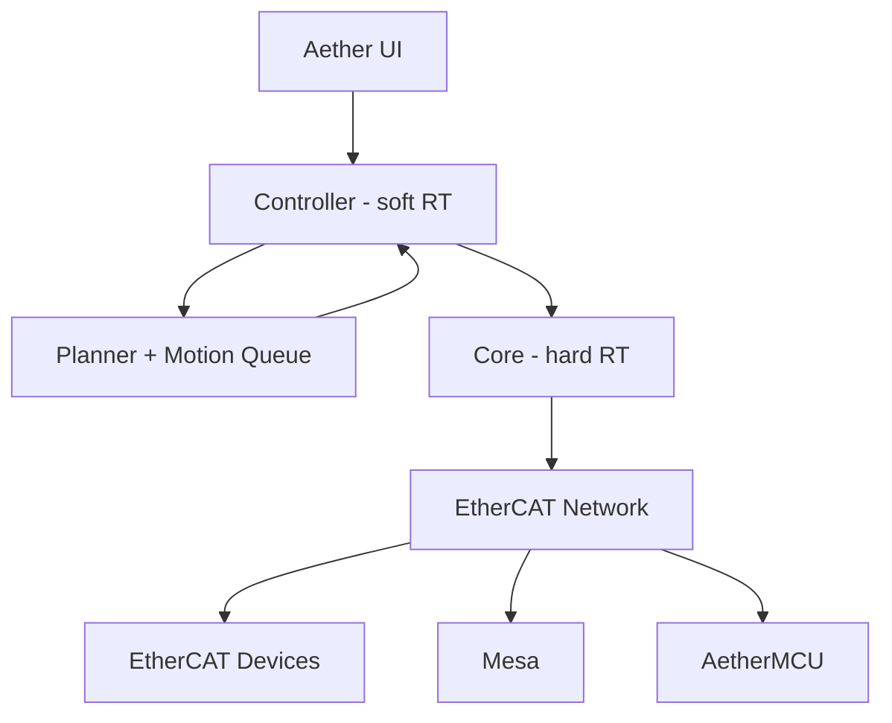

import { Callout } from "fumadocs-ui/components/callout";
import { Cards, Card } from "fumadocs-ui/components/card";
import { Accordion, Accordions } from 'fumadocs-ui/components/accordion';

import { Cpu, Lightbulb, PackageOpen } from "lucide-react";

<Callout type="warning">
  ## This documentation is in its very early stages. [!toc] [#alpha-warning]
  We are still working on the alpha release of Aether. 
  Expect things to change and break frequently as we continue to develop the project.
</Callout>

## Overview [#overview]

Aether is a Rust-based framework for high‑performance motion control. It is both a set of composable libraries and a host runtime that coordinates real‑time control across heterogeneous devices. The same building blocks power domain solutions like Aether Printer (3D printing) while remaining usable as standalone crates in other robotics and montion control contexts.

- Libraries compose into applications and can be used independently.
- The system can combine EtherCAT devices, Mesa cards, and “AetherMCU” boards in one installation.
- Components emphasize determinism, tight real‑time loops, and low overhead.

## Goals [#goals]

- Be the obvious choice for robot motion control tasks.
- Meet hard real‑time constraints (e.g., EtherCAT cycle times) while keeping higher‑level logic responsive.
- Enable zero‑copy, low‑overhead interfaces between controller and core.
- Provide modular crates with stable surfaces and compile‑time enforced versioning where linked.
- Support device discoverability and simple configuration of devices through well‑defined descriptors.
- Log relevant metrics to reproduce exact machine state and motion paths.
- To be a modern Rust based etherCAT capable LinuxCNC replacement.

## Architecture [#architecture]

### Core and Controller

- Core: hard real‑time. Executes motion schedules and device I/O within strict cycle budgets.
- Controller: soft real‑time. Feeds the core; if it falls behind, the core safely waits for new commands.
- Linking: prefer in‑process linking (controller + core in Rust) to avoid serialization and enable direct data sharing.

### Planner and Motion Queues

- Planner accepts long sequences (e.g., G‑code), enforces machine limits, and produces motion segments.
- Motion queues flow from planner to core; the core marks execution and exposes how much is committed for replanning.
- Control modes (e.g., position follower) sample from movement queues; the planner can update or replace segments.

### Interfaces and Versioning

- Keep controller↔core communication low‑overhead; link for compile‑time API guarantees.
- Introduce explicit serialization only when a stable external interface is required.
- Thin controller patterns allow wrappers (e.g., PyO3 or FFI) without compromising real‑time boundaries.

### Scope and Discoverability

- Keep the real‑time path strictly EtherCAT to limit scope and ensure determinism.
- Integrate non‑real‑time pieces on the controller side.
- Use existing EtherCAT XML descriptors and add higher‑level descriptors when needed; the UI should identify connected hardware and map it to functions.

### High‑Level Diagram [#high-level-diagram]

## Hardware & Protocols [#hardware-protocols]

<Cards>
  <Card title="Device Model" icon={<Lightbulb />}>
      - Treat microcontroller nodes like EtherCAT devices.
      - Use a register‑based protocol for MCUs to align with established fieldbus patterns and support protocol evolution.
  </Card>
  <Card title="Boards and Drivers" icon={<Cpu />}>
    - Focus on a curated set of BSPs (e.g., BTT Kraken, then Octopus) rather than a large hardware matrix.
    - Prefer driver “direct mode” where possible; use very high effective microstepping on the device while keeping host communication compact.
  </Card>
  <Card title="Packaging and Updates" icon={<PackageOpen />}>
    - Aether Printer is distributable as a packaged binary.
    - MCU updates depend on the platform (e.g., DFU on some boards; some EtherCAT devices may not be updated in the field).
    - Minimize firmware churn by decoupling host releases from MCU firmware where feasible.
  </Card>
</Cards>

## What you can build [#what-you-can-build]

Aether is a launchpad for motion‑centric projects — from hobby robots to production‑grade machines. Here are a few ways to put it to work:

- 3D printers with precision and insight
  - Build on Aether Printer to drive multi‑axis printers at high control rates.
  - Run drivers in direct modes with very high effective microstepping while keeping host communication compact.
  - Capture deterministic logs so you can reproduce exact print states, compare paths, and debug confidently.

- Robotics, CNC, and pick‑and‑place
  - Compose planners and control modes for arms, gantries, and routers.
  - Re‑plan motion on the fly when sensors, cameras, or external systems provide late‑arriving inputs.
  - Keep hard real‑time in the core while pushing iterative logic to a responsive controller.

## Where it fits [#where-it-fits]

- Aether provides the motion control substrate for robotics and machines that benefit from deterministic timing, EtherCAT networking, and modular composition.
- For 3D printing, Aether Printer integrates these pieces into an end‑to‑end firmware stack.
- Bridging to other ecosystems is possible via modules on the real‑time side without bending the core architecture.

## What Aether is Not [#what-aether-is-not]

- Tied to vendor lock‑in or C++‑centric stacks.
- Locked into recompiling MCU firmwares in lockstep with host releases; the system should discover and configure compatible devices.
- Aiming for plug‑and‑play on arbitrary boards in early phases; curated BSPs keep complexity in check.
- Chasing the extreme MCU flexibility approach; prioritize predictable, high‑performance hardware compositions.
- On a fixed public timeline; quality and correctness come first.
